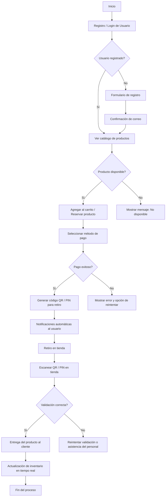

# Plataforma Web de E-commerce con Reserva y Retiro en Tienda

## Descripción General

Este proyecto tiene como propósito **transformar la experiencia de compra de electrodomésticos** mediante una plataforma web moderna que permite a los usuarios **consultar productos, verificar disponibilidad en tiempo real, realizar pagos en línea y programar el retiro en tienda** mediante un sistema automatizado con **código QR, PIN o código de retiro**.  

La solución busca **optimizar la operación interna de los establecimientos**, reducir tiempos de espera y mejorar la satisfacción del cliente, implementando una arquitectura escalable basada en **ReactJS (frontend), Express (backend)** y **Vercel (despliegue y hosting)**.

---

## Objetivos del Proyecto

### Objetivo General
Diseñar e implementar una **plataforma web interactiva y responsiva** que permita la compra, reserva y retiro en tienda de productos, con integración de pagos en línea y gestión eficiente del inventario.

### Objetivos Específicos
- Analizar las necesidades del usuario final y los flujos de compra existentes.
- Desarrollar un **frontend responsivo** con ReactJS que facilite la navegación y la experiencia del cliente.
- Implementar un **backend con Express** para gestionar usuarios, pedidos, inventario y notificaciones.
- Integrar pasarelas de pago seguras (Epayco, MercadoPago, etc.).
- Desplegar el sistema completo en **Vercel**, asegurando estabilidad, escalabilidad y disponibilidad.
- Validar la solución mediante **pruebas funcionales y de rendimiento** antes de su implementación definitiva.

---

## Diagrama de Flujo del Sistema



---

## Historias de Usuario

| Código | Historia de Usuario                                                                                   | Criterios de Aceptación                                     | Puntos |
|:-------|:------------------------------------------------------------------------------------------------------|:------------------------------------------------------------|:------:|
| HU-01  | Como cliente quiero registrarme con mi correo electrónico para acceder al sistema.                    | Validación de correo y confirmación automática.             |   3    |
| HU-02  | Como cliente quiero consultar disponibilidad en tiempo real para evitar desplazamientos innecesarios. | Actualización inmediata del stock visible.                  |   5    |
| HU-03  | Como usuario deseo realizar pagos en línea de forma segura.                                           | Integración de pasarela de pago y confirmación instantánea. |   8    |
| HU-04  | Como cliente quiero recibir notificaciones automáticas sobre el estado de mi pedido.                  | Envío de correo y SMS en cada cambio de estado.             |   5    |
| HU-05  | Como cliente deseo obtener un código QR para retirar mi producto en tienda.                           | Generación automática y validación al momento del retiro.   |   5    |
| HU-06  | Como administrador deseo actualizar el inventario en tiempo real.                                     | Sincronización inmediata tras cada venta o reserva.         |   5    |
| HU-07  | Como gerente quiero acceder a reportes de ventas y pedidos.                                           | Panel administrativo con filtros y exportación de datos.    |   8    |

---

## Criterios de Aceptación Globales

1. **Funcionalidad de la Plataforma:**

   * Permitir compras, reservas y retiros en tienda.
   * Generar y validar códigos QR de retiro.
   * Enviar notificaciones automáticas por correo/SMS.

2. **Experiencia de Usuario:**

   * Interfaz intuitiva y adaptable a distintos dispositivos.
   * Carga rápida y navegación fluida.
   * Información de producto completa y visible.

3. **Integración de Servicios:**

   * Pagos en línea seguros y funcionales.
   * Inventario sincronizado en tiempo real.

4. **Pruebas y Rendimiento:**

   * Validación funcional completa sin errores críticos.
   * Soporte para múltiples usuarios concurrentes.

5. **Cumplimiento de Plazos:**

   * Entrega del sistema funcional en un plazo máximo de 8 semanas.

---

## Resultados Esperados

* **Plataforma web funcional** con proceso completo de compra y retiro.
* **Gestión eficiente del inventario** y actualización automática de stock.
* **Reducción de filas y tiempos de atención** mediante retiro con código QR.
* **Automatización de notificaciones** para mantener informado al cliente.
* **Mejora comprobable en la satisfacción del usuario** y eficiencia operativa.

---

## Tecnologías Utilizadas

| Capa                                      | Tecnología           | Descripción                                                         |
|-------------------------------------------|----------------------|---------------------------------------------------------------------|
| **Frontend**                              | ReactJS              | Framework JavaScript para UI dinámicas y responsivas.               |
| **Backend**                               | Express.js           | Framework minimalista de Node.js para la API REST.                  |
| **Hosting y Deploy**                      | Vercel               | Infraestructura de despliegue serverless para proyectos React/Node. |
| **Base de Datos (futura implementación)** | MongoDB              | Para persistencia de usuarios, pedidos e inventario.                |
| **Pasarelas de pago**                     | Epayco / MercadoPago | Integración segura de transacciones.                                |
| **Notificaciones**                        | Twilio / SendGrid    | Envío automatizado de correos y SMS.                                |

---

## Arquitectura General

```shell
Cliente (ReactJS)  <-->  API REST (Express.js)  <-->  BD (MongoDB)
                         |
                         └──> Servicios externos: Epayco, SendGrid, Twilio, ...
```

---

## Despliegue

### Requisitos Previos

* Node.js v22 o superior
* npm o yarn
* Cuenta en Vercel vinculada con GitHub

### Instalación y Ejecución

```bash
# Clonar el repositorio
git clone https://github.com/AWP-Software/proyecto-de-software-ibero.git

# Ingresar al directorio
cd proyecto-de-software-ibero

# Instalar dependencias
npm install

# Iniciar el entorno local
npm run dev
```
